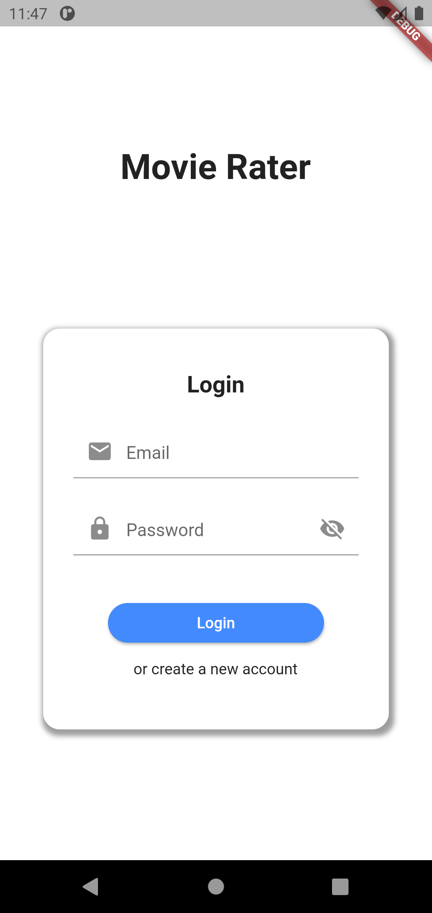
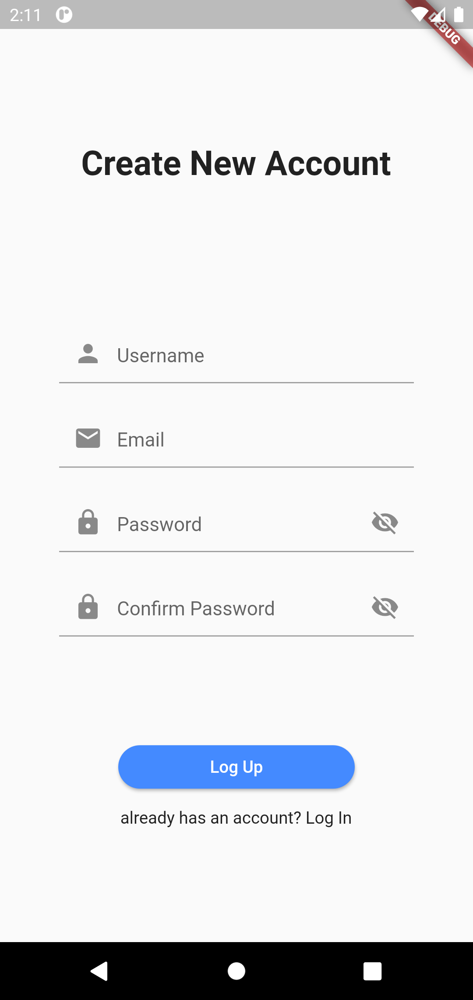
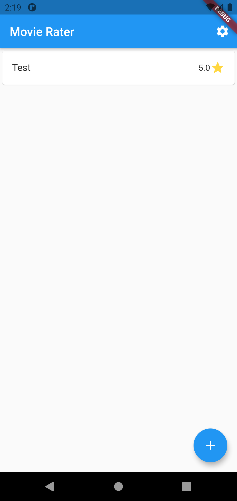
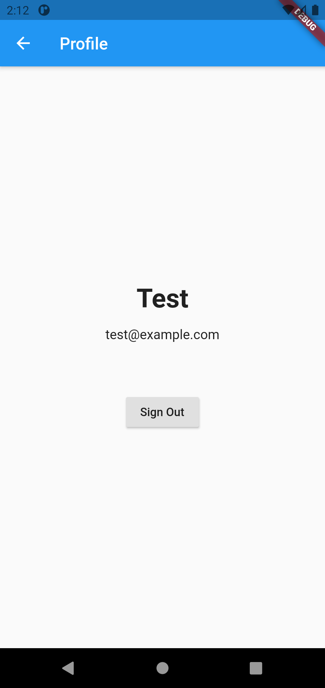
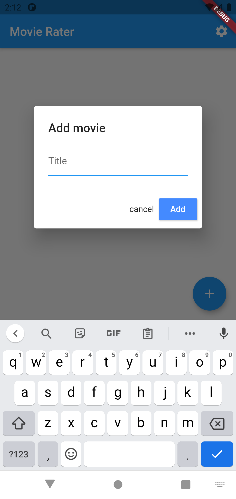
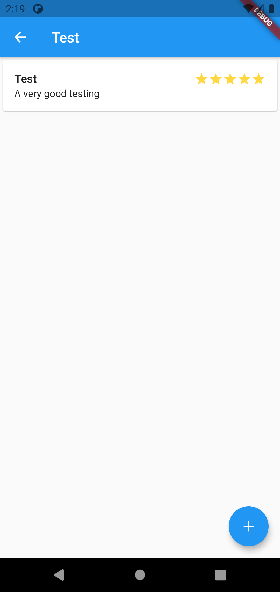
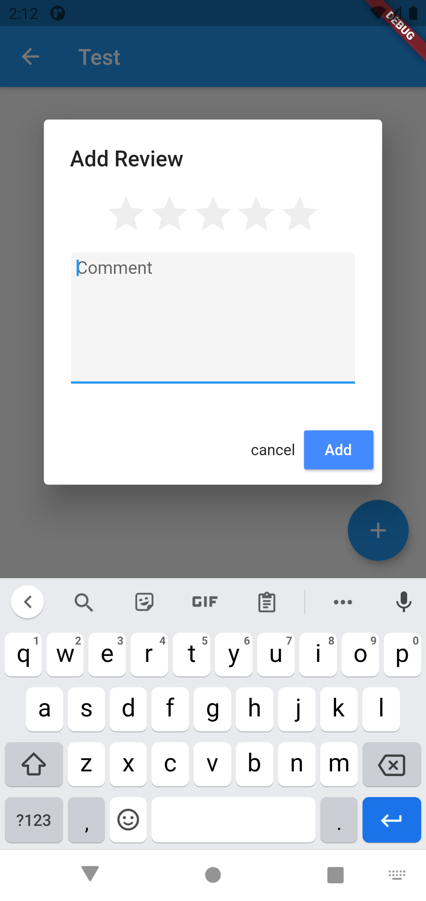

# movie_rater

A movie rater application made with flutter and uses GO Rest API for accessing data in MySQL database.

### Features

- Create account & login
- View movies & reviews
- Add movie & review
- Auto refresh (every 15 seconds)
- Manual refresh (pull down)

### Dependencies

- [http](https://pub.dev/packages/http)
- [flutter_secure_storage](https://pub.dev/packages/flutter_secure_storage)
- [provider](https://pub.dev/packages/provider)
- [flutter_rating_bar](https://pub.dev/packages/flutter_rating_bar)

### API

- [Rest API](https://github.com/xiaoming857/movie_rater_restapi)

### Usage

Rest API settings are located in "/[path_to_project_folder]/movie_rater_app/lib/src/services" folder. The base URL is located in auth.dart file and its link is "http://10.0.2.2:8080/api" on API that runs locally. For the API used in this project, please visit [Rest API](https://github.com/xiaoming857/movie_rater_restapi).

Endpoints are located in the methods. Refresh, login, and register methods are located in auth.dart file. Get movies, add movie, get reviews, and add review are located in api.dart file.

### Screenshots

1. Sign In Page

   

2. Sign Up Page

   

3. Home Page

   

4. Sign Out Page

   

5. Add Movie Dialog

   

6. Review Page

   

7. Add Review Dialog

   

